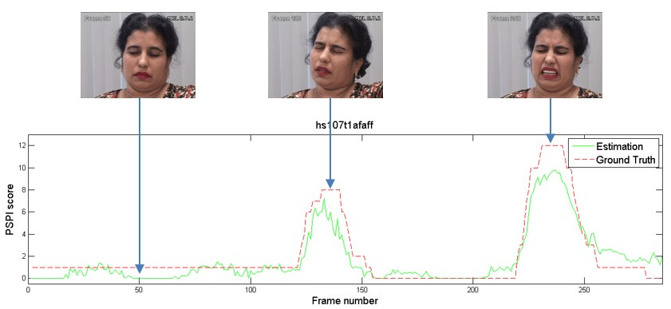

# PainfulScoreEstimation

## Demo video

 
	

    	

      		
      		
Weight Lifting

    	

		

			
			
Childbirth

		

	

- Weight Lifting https://youtu.be/B5e_udgH9D8
- Childbirth https://youtu.be/sonvJNeTp9Q
- Self Test https://youtu.be/hP4KmjBfKqI

## Estimation VS Ground Truth in a sample

## Begins at my Master's Thesis

- Thesis PDF in National Central Library [Link](http://handle.ncl.edu.tw/11296/ndltd/22213658258720259065)
- Slide Share [Link](https://www.slideshare.net/LinKaoYuan/ss-65635578)

## Training

- Training Data: [The UNBC-McMaster Shoulder Pain Expression Archive Database](http://www.pitt.edu/~emotion/um-spread.htm)
- Training Devivce/Cost: i5-4210M/8G RAM with 6hours/200epochs

## My build enviroment

- EmguCV（libemgucv-windesktop-3.4.1.2976）
- Microsoft Visual Studio Community 2017 Version 15.6.6
- Microsoft .NET Framework Version 4.7.03056

## Executable/Binaries

- [Release of the repo](https://github.com/mosdeo/PainfulScoreEstimation/releases)
- Runtime dependence
  - A Camera
  - Microsoft .NET Framework Version 4.6.1 above